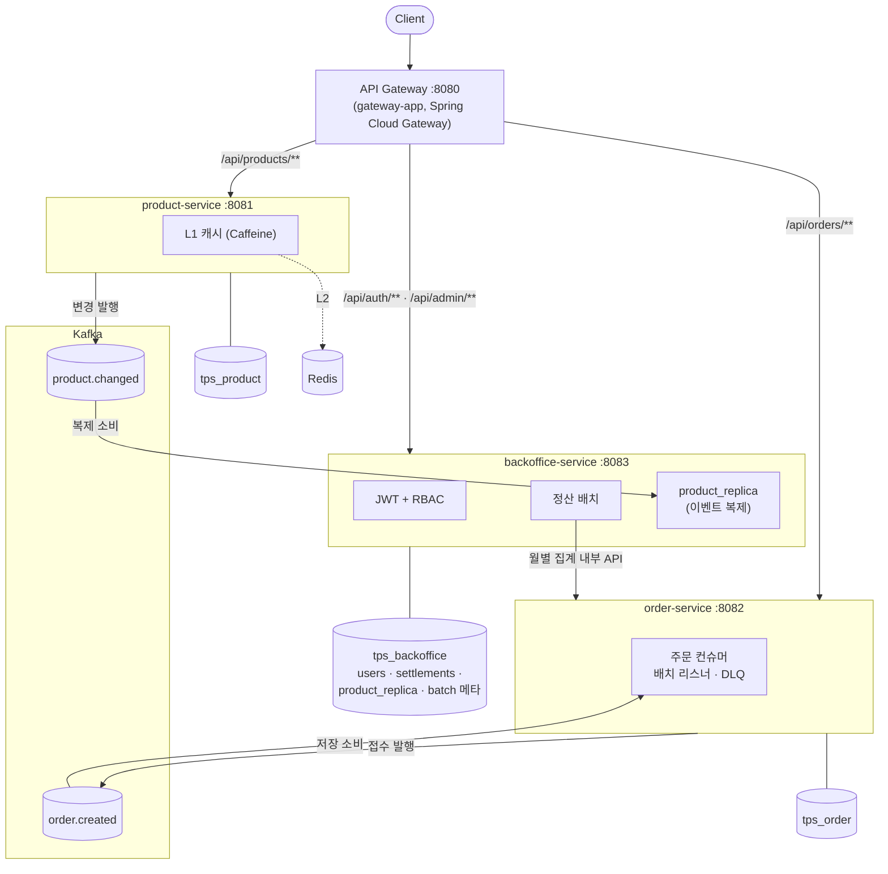

# Event-Driven Commerce — 1000 TPS 실증 포트폴리오 (msa 브랜치)

> 이력서에 적은 백엔드 역량(Kafka 비동기 처리, 캐시 계층화, RBAC/Batch, 고부하 처리)을
> **직접 구현하고, 부하를 걸어 측정하고, 그 근거를 문서로 남긴** 데모 시스템입니다.
> 완성품 이커머스가 아니라 핵심 기술 포인트를 실증하는 것이 목적이며,
> 모든 설계의 "왜"는 [docs/decisions.md](docs/decisions.md), 모든 수치는 [docs/benchmarks.md](docs/benchmarks.md)에 있습니다.

> **이 브랜치(msa)는 main의 모놀리스를 단계적으로 MSA 구조로 전환한 버전입니다.**
> Gradle 멀티모듈 → 이벤트 기반 데이터 복제 → 서비스별 앱 분리 → 내부 API 전환 → DB 분리 → API 게이트웨이까지 6단계 완료.
> main은 아래 수치를 측정한 모놀리스를 그대로 보존합니다 (측정 기준). 전환 과정 전체는 [docs/msa-architecture.md](docs/msa-architecture.md)와 decisions.md 17~22번.

## 핵심 결과 (요약)

| 측정 | 결과 |
|---|---|
| 주문 접수: 동기 vs Kafka 비동기 (1000 req/s) | p95 **0.44\~2.5s → 1.3\~1.6ms**, drop 3,484 → **0** |
| 컨슈머 처리량: 레코드 단위 → 배치 리스너 + JDBC batch | **195건/s → 2,000건/s 이상** (스레드 수 동일, I/O 구조만 변경) |
| 상품 조회: MySQL → L2(Redis) → L1(Caffeine) (1000 req/s) | p95 **541ms → 3.8ms → 577µs** |
| 종합 혼합 부하 (조회 80% + 주문 20%) | **1000 TPS: 에러 0%, drop 0, p95 ≤3.5ms, 저장까지 ≤2초** — 한계는 3000\~5000/s 사이 |
| 데이터 정합성 (전 측정 누적) | 주문 중복 **0**, 미처리 **0** (멱등 키 + DB 유니크 제약) |

> 부하기(k6)·앱·Docker가 같은 머신에서 동작한 측정 — 절대값보다 구성 간 상대 비교가 목적입니다.
> 수치는 모놀리스 구성(main) 기준이며, 게이트웨이 홉이 추가된 MSA 구성은 별도 베이스라인이 필요해 재측정하지 않았습니다.
> 방법론과 한계는 [benchmarks.md](docs/benchmarks.md) 참고.

## 4개 핵심 축

1. **주문 처리 — 동기 vs Kafka 비동기**
   동기(요청 경로에서 DB INSERT)와 비동기(Kafka 발행 후 즉시 202, 컨슈머가 저장·후속 처리)를 둘 다 구현해 같은 부하로 비교.
   멱등 처리(orderKey + DB 유니크 제약), 재시도 + DLQ, 배치 컨슈머 전환까지 — 병목을 측정으로 찾고 구조를 바꿔 다시 측정.
2. **상품 조회 캐시 계층화 — L1(Caffeine) → L2(Redis) → MySQL**
   look-aside 2계층, 커밋 후 delete 무효화, Redis pub/sub 기반 L1 정합성, Cache Stampede 대응(single-flight + TTL jitter).
   계층별 효과를 Redis 히트 카운터 델타로 검증.
3. **백오피스 — Spring Security RBAC + Spring Batch**
   JWT(HS256) 인증, USER/ADMIN 역할 분리(`/api/admin/**`), 월별 정산 배치(clear→aggregate 2스텝, 재실행 멱등).
4. **부하테스트 — k6, 1000 TPS 목표**
   오픈 모델(constant-arrival-rate)로 coordinated omission 회피, 워밍업 절차 고정, 스레드 풀 튜닝 실험 포함.
   측정 시나리오는 [load-test/](load-test/), 전체 수치는 [benchmarks.md](docs/benchmarks.md).

## MSA 전환 (이 브랜치)

모놀리스에서 출발해 **돌아가는 상태를 유지하며** 한 번에 한 결합씩 끊었습니다. 각 단계의 결정 근거와 대안 비교는 decisions.md 17~22번.

| 단계 | 내용 | 근거 |
|---|---|---|
| 1 | Gradle 멀티모듈 — 패키지 관례였던 도메인 경계를 모듈 경계로 승격 (위반 = 컴파일 에러), common 해체 | decisions 17 |
| 2 | 정산→상품 컴파일 의존 해소 — `product.changed` 이벤트 → 로컬 `product_replica` 복제 (JSON 계약, 클래스 공유 없음) | decisions 18 |
| 3a | 서비스별 부트 앱 분리 — product :8081 / order :8082 / backoffice :8083, 조합 앱(`app`)은 테스트 하네스로 유지 | decisions 19 |
| 3b-1 | 정산의 `FROM orders` 직접 SQL(숨은 데이터 결합) 해소 — order-service 월별 집계 내부 API로 전환 | decisions 20 |
| 3b-2 | DB 분리 — 서비스별 스키마(`tps_product`·`tps_order`·`tps_backoffice`) + 컨슈머 그룹 분리 | decisions 21 |
| 3c | API 게이트웨이(`gateway-app` :8080, Spring Cloud Gateway) — 모놀리스와 동일 포트, 클라이언트 인터페이스 불변 | decisions 22 |

전환에서 나온 면접 포인트 몇 가지:

- **같은 결합도 워크로드가 답을 가른다** — 상품(건별 다회 조회)은 이벤트 복제, 주문 집계(월 1회)는 동기 내부 API. 반대 선택의 이유가 각각 있다 (decisions 18·20).
- **단일 DB가 숨기고 있던 결합** — 컴파일 의존을 다 끊은 뒤에도 정산이 `FROM orders`로 타 도메인 테이블을 직접 집계하고 있었다. DB를 분리하는 순간 깨지는 종류의 결합 (decisions 20).
- **컨슈머 그룹은 배포 단위(DB)마다 분리** — 하네스와 분리 앱이 그룹을 공유하면 경쟁 소비로 주문이 두 DB에 쪼개진다 (3b-2 작업 중 실제 발생, decisions 21). 복제본은 새 그룹 + earliest로 토픽을 재생해 재구축.
- **`/internal/**`은 게이트웨이 비라우팅 + 공유 시크릿** — 외부 진입점에서 404, 포트 직접 접근도 `X-Internal-Token` 검증(상수 시간 비교)에 걸린다 (decisions 22·23).
- **시크릿 외부화** — JWT 키·DB/관리자 비밀번호는 `${ENV_VAR:로컬기본값}` 패턴. 데모는 clone 직후 실행 가능, 운영은 환경변수/비밀관리자 주입 (decisions 23).
- **로그인 브루트포스 방어** — 게이트웨이에서 `/api/auth/**`만 IP별 토큰 버킷(RedisRateLimiter, 2/s·burst 5) → 429. 부하테스트 경로엔 걸지 않아 측정 조건 불변 (decisions 24).

## 아키텍처



> DB는 서비스별 스키마로 분리 (같은 MySQL 인스턴스 — 로컬 데모 한계, 운영이면 인스턴스도 분리).
> 모놀리스 시절 구조는 [docs/architecture.md](docs/architecture.md), 전환 전체 그림은 [docs/msa-architecture.md](docs/msa-architecture.md).

### 모듈 구성

```
product/          도메인 라이브러리 (캐시 계층 포함)
order/            도메인 라이브러리 (Kafka 컨슈머 포함)
backoffice/       도메인 라이브러리 (RBAC·배치·복제본 포함)
product-app/      :8081 부트 앱 (DB: tps_product)
order-app/        :8082 부트 앱 (DB: tps_order)
backoffice-app/   :8083 부트 앱 (DB: tps_backoffice)
gateway-app/      :8080 API 게이트웨이 — 클라이언트 단일 진입점
app/              조합 앱 — 통합 테스트 하네스 (전 도메인 단일 컨텍스트, :8080이라 게이트웨이와 동시 기동 불가)
```

## 기술 스택

- Java 17, Spring Boot 3.5 (Web, Data JPA, Security, Batch, Validation, Actuator) — Gradle 멀티모듈
- Spring Cloud Gateway (API 게이트웨이, 경로 라우팅 Java DSL)
- MySQL 8.0 (서비스별 스키마), Redis 7 (L2 캐시·pub/sub), Caffeine (L1 캐시)
- Kafka 3.8 (KRaft) — Producer/Consumer(배치 리스너), DLQ, 재시도, 이벤트 기반 데이터 복제
- Docker Compose, k6 (부하테스트)
- Prometheus + Grafana — Micrometer 메트릭, 데이터소스·대시보드 프로비저닝 코드화 ([monitoring/](monitoring/))

## 실행 방법

```bash
# 1. 인프라 기동 (MySQL 3307, Redis 16379, Kafka 9092, Prometheus 9090, Grafana 3000)
docker compose up -d
# 기존 볼륨을 재사용한다면 docker/mysql-init의 서비스별 스키마 생성을 1회 수동 적용

# 2. 서비스 빌드 + 기동 (Java 17 필요)
./gradlew assemble
java -jar product-app/build/libs/product-app-0.0.1-SNAPSHOT.jar        # :8081
java -jar order-app/build/libs/order-app-0.0.1-SNAPSHOT.jar            # :8082
java -jar backoffice-app/build/libs/backoffice-app-0.0.1-SNAPSHOT.jar  # :8083
java -jar gateway-app/build/libs/gateway-app-0.0.1-SNAPSHOT.jar        # :8080 — 이후 모든 호출은 8080으로

# 3. 통합 테스트 — 조합 앱(app)이 전 도메인을 한 컨텍스트로 띄움 (인프라가 떠 있어야 함)
./gradlew test

# 4. 부하테스트 예시 (k6 필요)
k6 run -e RATE=1000 -e DURATION=30s load-test/order-sync-baseline.js
k6 run -e TOTAL_RATE=1000 -e DURATION=30s load-test/mixed-final.js
```

- 관리자 시드 계정: `admin` / `admin1234!` (데모용 — backoffice-app `application.yml`)
- 정산 실행: `POST /api/admin/settlements/run?month=2026-06` (ADMIN 토큰 필요, 게이트웨이 :8080 경유)
- 모니터링 대시보드: http://localhost:3000 (`admin` / `admin1234`) — 스크레이프 타깃은 :8080 단일 구성 기준 (서비스별 타깃 확장은 데모 범위 밖, [msa-architecture.md](docs/msa-architecture.md) 참고)

## 문서

| 문서 | 내용 |
|---|---|
| [docs/decisions.md](docs/decisions.md) | 설계 결정 24개 — 기술 선택의 이유, 대안, 트레이드오프 (17~22번이 MSA 전환, 23~24번이 보안 하드닝) |
| [docs/msa-architecture.md](docs/msa-architecture.md) | MSA 전환 단계·목표 아키텍처·바꿔야 했던 구조 전체 목록 |
| [docs/benchmarks.md](docs/benchmarks.md) | 측정 4종 — 환경, 시나리오, 수치, 병목 분석, 한계 |
| [docs/architecture.md](docs/architecture.md) | 모놀리스(전환 전) 전체 구조 |
| [docs/scalable-architecture.md](docs/scalable-architecture.md) | 운영 환경(AWS) 확장 설계 |
| [docs/interview-qa.md](docs/interview-qa.md) | 면접 예상 꼬리 질문·답변 — 결정 번호로 근거 인용 |

## License

© 2026 Ji Yong Park. All rights reserved.

This repository is a personal portfolio project, shared publicly for review and evaluation purposes only.
The code may not be copied, reused, modified, or redistributed without explicit written permission.

### 라이선스

© 2026 박지용. All rights reserved.

이 저장소는 개인 포트폴리오 프로젝트로, 검토·평가 목적의 공개입니다.
명시적 서면 허가 없이 코드를 복제·재사용·수정·재배포할 수 없습니다.
