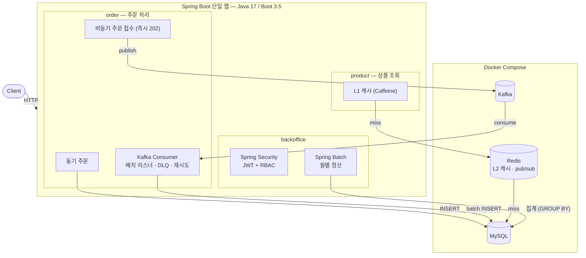

# Event-Driven Commerce — 1000 TPS 실증 포트폴리오

> 이력서에 적은 백엔드 역량(Kafka 비동기 처리, 캐시 계층화, RBAC/Batch, 고부하 처리)을
> **직접 구현하고, 부하를 걸어 측정하고, 그 근거를 문서로 남긴** 데모 시스템입니다.
> 완성품 이커머스가 아니라 핵심 기술 포인트를 실증하는 것이 목적이며,
> 모든 설계의 "왜"는 [docs/decisions.md](docs/decisions.md), 모든 수치는 [docs/benchmarks.md](docs/benchmarks.md)에 있습니다.

## 핵심 결과 (요약)

| 측정 | 결과 |
|---|---|
| 주문 접수: 동기 vs Kafka 비동기 (1000 req/s) | p95 **0.44\~2.5s → 1.3\~1.6ms**, drop 3,484 → **0** |
| 컨슈머 처리량: 레코드 단위 → 배치 리스너 + JDBC batch | **195건/s → 2,000건/s 이상** (스레드 수 동일, I/O 구조만 변경) |
| 상품 조회: MySQL → L2(Redis) → L1(Caffeine) (1000 req/s) | p95 **541ms → 3.8ms → 577µs** |
| 종합 혼합 부하 (조회 80% + 주문 20%) | **1000 TPS: 에러 0%, drop 0, p95 ≤3.5ms, 저장까지 ≤2초** — 한계는 3000\~5000/s 사이 |
| 데이터 정합성 (전 측정 누적) | 주문 중복 **0**, 미처리 **0** (멱등 키 + DB 유니크 제약) |

> 부하기(k6)·앱·Docker가 같은 머신에서 동작한 측정 — 절대값보다 구성 간 상대 비교가 목적입니다.
> 방법론과 한계는 [benchmarks.md](docs/benchmarks.md) 참고.

## 4개 핵심 축

1. **주문 처리 — 동기 vs Kafka 비동기**
   동기(요청 경로에서 DB INSERT)와 비동기(Kafka 발행 후 즉시 202, 컨슈머가 저장·후속 처리)를 둘 다 구현해 같은 부하로 비교.
   멱등 처리(orderKey + DB 유니크 제약), 재시도 + DLQ, 배치 컨슈머 전환까지 — 병목을 측정으로 찾고 구조를 바꿔 다시 측정.
2. **상품 조회 캐시 계층화 — L1(Caffeine) → L2(Redis) → MySQL**
   look-aside 2계층, 커밋 후 delete 무효화, Redis pub/sub 기반 L1 정합성, Cache Stampede 대응(single-flight + TTL jitter).
   계층별 효과를 Redis 히트 카운터 델타로 검증.
3. **백오피스 — Spring Security RBAC + Spring Batch**
   JWT(HS256) 인증, USER/ADMIN 역할 분리(`/api/admin/**`), 월별 정산 배치(clear→aggregate 2스텝, 재실행 멱등).
4. **부하테스트 — k6, 1000 TPS 목표**
   오픈 모델(constant-arrival-rate)로 coordinated omission 회피, 워밍업 절차 고정, 스레드 풀 튜닝 실험 포함.
   측정 시나리오는 [load-test/](load-test/), 전체 수치는 [benchmarks.md](docs/benchmarks.md).

## 아키텍처



상세: [docs/architecture.md](docs/architecture.md) · 멀티 인스턴스/AWS 확장 설계: [docs/scalable-architecture.md](docs/scalable-architecture.md)

## 기술 스택

- Java 17, Spring Boot 3.5 (Web, Data JPA, Security, Batch, Validation, Actuator)
- MySQL 8.0, Redis 7 (L2 캐시·pub/sub), Caffeine (L1 캐시)
- Kafka 3.8 (KRaft) — Producer/Consumer(배치 리스너), DLQ, 재시도
- Docker Compose, k6 (부하테스트)
- Prometheus + Grafana — Micrometer 메트릭, 데이터소스·대시보드 프로비저닝 코드화 ([monitoring/](monitoring/))

## 실행 방법

```bash
# 1. 인프라 기동 (MySQL 3307, Redis 16379, Kafka 9092, Prometheus 9090, Grafana 3000)
docker compose up -d

# 2. 애플리케이션 (Java 17 필요)
./gradlew bootRun

# 3. 통합 테스트 (인프라가 떠 있어야 함)
./gradlew test

# 4. 부하테스트 예시 (k6 필요)
k6 run -e RATE=1000 -e DURATION=30s load-test/order-sync-baseline.js
k6 run -e TOTAL_RATE=1000 -e DURATION=30s load-test/mixed-final.js
```

- 관리자 시드 계정: `admin` / `admin1234!` (데모용 — `application.yml`)
- 정산 실행: `POST /api/admin/settlements/run?month=2026-06` (ADMIN 토큰 필요)
- 모니터링 대시보드: http://localhost:3000 (`admin` / `admin1234`) — 처리량·p95/p99·에러율·커넥션 풀·Kafka 리스너 패널 자동 프로비저닝

## 문서

| 문서 | 내용 |
|---|---|
| [docs/decisions.md](docs/decisions.md) | 설계 결정 15개 — 기술 선택의 이유, 대안, 트레이드오프 |
| [docs/benchmarks.md](docs/benchmarks.md) | 측정 4종 — 환경, 시나리오, 수치, 병목 분석, 한계 |
| [docs/architecture.md](docs/architecture.md) | 전체 구조 |
| [docs/scalable-architecture.md](docs/scalable-architecture.md) | 운영 환경(AWS) 확장 설계 |

## License

© 2026 Ji Yong Park. All rights reserved.

This repository is a personal portfolio project, shared publicly for review and evaluation purposes only.
The code may not be copied, reused, modified, or redistributed without explicit written permission.

### 라이선스

© 2026 박지용. All rights reserved.

이 저장소는 개인 포트폴리오 프로젝트로, 검토·평가 목적의 공개입니다.
명시적 서면 허가 없이 코드를 복제·재사용·수정·재배포할 수 없습니다.
