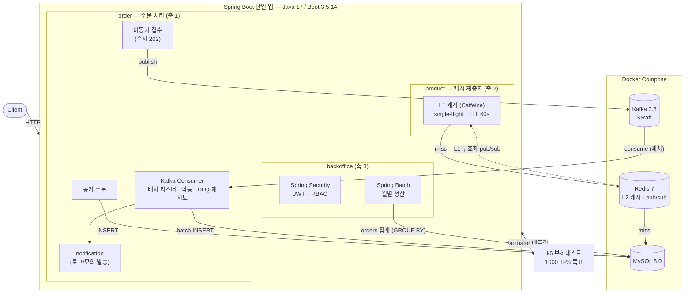
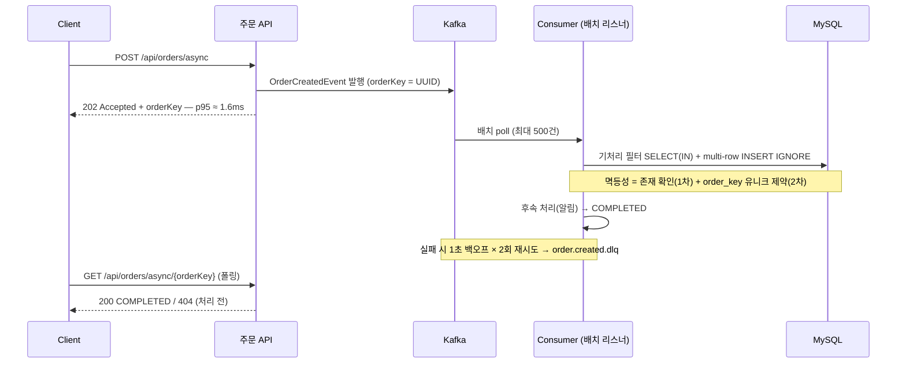

# 아키텍처 (Architecture)

> 전체 구조와 4개 핵심 축. 상세 설계 결정은 [decisions.md](./decisions.md), 측정은 [benchmarks.md](./benchmarks.md).

## 한눈에 보기



## 비동기 주문 흐름 (축 1 핵심)



## 모듈(패키지) 구조
```
com.jypark.tps1000
 ├─ order        # 축 1: 주문 — 동기 / Kafka 비동기, DLQ·재시도, 멱등성
 ├─ product      # 축 2: 상품 조회 — L1(Caffeine)/L2(Redis)/MySQL 캐시 계층화
 ├─ backoffice   # 축 3: RBAC(Spring Security) + 정산 배치(Spring Batch)
 └─ common       # 공통 설정, 예외, 응답 포맷 등
```

## 4개 핵심 축
1. **주문 처리** — 동기 vs Kafka 비동기를 둘 다 구현해 TPS·응답시간 비교 측정. 비동기는 접수 즉시 응답 + 컨슈머 후속처리. DLQ·재시도·멱등(주문ID).
2. **상품 조회 캐시 계층화** — L1(Caffeine) → L2(Redis) → MySQL. 무효화 전략, L1/L2 정합성, Cache Stampede 대응.
3. **백오피스** — Spring Security RBAC(관리자/일반 분리) + Spring Batch 월별 정산 잡 1개.
4. **부하테스트** — k6로 핵심 엔드포인트(주문)에 1000 TPS 목표. 시나리오·수치·병목을 benchmarks.md에 기록.

## 인프라 (docker-compose.yml)
| 서비스 | 이미지 | 호스트 포트 | 용도 |
|---|---|---|---|
| MySQL | mysql:8.0 | 3307 | 영속 저장소 (3306은 로컬 mysqld 점유로 회피) |
| Redis | redis:7-alpine | 16379 | L2 캐시 / 세션 (AOF) — 6379는 Windows 예약 포트 범위라 회피 |
| Kafka | apache/kafka:3.8.1 | 9092 | 비동기 메시징 (KRaft 단일 노드) |

## 실행 방법
```powershell
# 1) 인프라 기동
docker compose up -d

# 2) 앱 실행 (JDK 17 명시)
$env:JAVA_HOME = 'C:\Program Files\Java\jdk-17'
.\gradlew.bat bootRun

# 3) 헬스체크
curl http://localhost:8080/actuator/health
```
