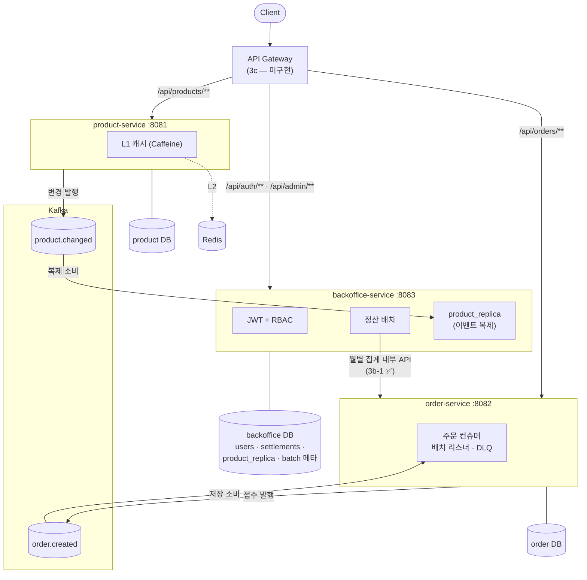

# MSA 전환 아키텍처 (msa 브랜치)

> main(모놀리스, 측정 기준)을 보존한 채 이 브랜치에서 단계적으로 MSA 구조로 전환한다.
> 각 단계의 결정 근거는 [decisions.md](decisions.md) 17~19번. 이 문서는 **목표 그림과 "바꿔야 할 구조" 전체 목록**이다.

## 전환 단계 요약

| 단계 | 내용 | 상태 |
|---|---|---|
| 1단계 | Gradle 멀티모듈 — 패키지 경계를 모듈 경계로 승격, common 해체 | ✅ (decisions 17) |
| 2단계 | 정산→상품 컴파일 의존 해소 — `product.changed` 이벤트 기반 데이터 복제 | ✅ (decisions 18) |
| 3a단계 | 서비스별 부트 앱 분리 (product 8081 / order 8082 / backoffice 8083) | ✅ (decisions 19) |
| 3b-1단계 | 정산→orders 직접 SQL 해소 — order-service 월별 집계 내부 API로 전환 | ✅ (decisions 20) |
| 3b-2단계 | DB 분리 — 서비스별 스키마(tps_product·tps_order·tps_backoffice) + 컨슈머 그룹 분리 | ✅ (decisions 21) |
| 3c단계 | API 게이트웨이, 인증 구조 변경(RS256), 서비스별 관측 | 미착수 |

## 목표 아키텍처



> 3b-2까지 완료된 현재, 위 그림에서 남은 것은 **게이트웨이(3c)뿐**이다 — 클라이언트가 포트 3개를 직접 호출한다.
> DB는 서비스별 스키마로 분리됐고(같은 MySQL 인스턴스 — 로컬 데모 한계, 운영이면 인스턴스도 분리),
> 조합 앱(app, 테스트 하네스)과 main(모놀리스)은 기존 tps1000 단일 스키마를 그대로 쓴다.

## 바꿔야 할 구조 목록

### ✅ 완료된 변경 (1·2·3a단계)

| 변경 | 모놀리스(main) | MSA(msa) | 근거 |
|---|---|---|---|
| 모듈 경계 | 패키지 관례 (위반해도 컴파일됨) | Gradle 모듈 — 경계 위반 = 컴파일 에러 | decisions 17 |
| "공통" 설정 | common/config에 3개 집중 | 각 도메인 소유로 회수 (Cache→product, Kafka→order, Security→backoffice) | decisions 17 |
| 정산의 상품 조회 | `ProductRepository` 직접 호출 | `product.changed` 이벤트 → 로컬 `product_replica` (클래스·상수 공유 없는 JSON 계약) | decisions 18 |
| 실행 단위 | 부트 앱 1개 (:8080) | 서비스별 부트 앱 3개 (:8081/:8082/:8083) + 조합 앱(`app`)은 테스트 하네스로 유지 | decisions 19 |

### ⬜ 남은 변경 (3b·3c단계)

**1. 정산 → orders 데이터 결합 해소 (3b의 선행 조건, 최대 난관) — ✅ 해소됨 (decisions 20)**

2단계에서 컴파일 의존은 product 하나였지만, **데이터 수준 결합이 하나 더 숨어 있었다**: 정산 리더(`monthlyOrderAggregateReader`)가 `FROM orders` SQL로 order 도메인의 테이블을 직접 GROUP BY 집계했다. 단일 DB라 보이지 않던 결합으로, DB를 분리하는 순간 깨진다. 검토했던 선택지:

| 방안 | 장점 | 단점 |
|---|---|---|
| (a) order-service에 월별 집계 API (`GET /internal/orders/monthly-sales?month=`) | 복제 없음, 정산은 월 1회라 동기 호출 비용 무시 가능 (N+1 아님 — 페이지 단위 호출) | 정산 실행이 order-service 가용성에 결합 (월 배치라 재시도로 흡수 가능) |
| (b) 주문 이벤트 복제 (order.created → backoffice 로컬 적재) | 정산 완전 독립 | **동기 주문은 이벤트를 발행하지 않아** 발행 지점 추가 필요 + 주문 전 건 복제는 볼륨 부담 |
| (c) CDC (Debezium 등) | 코드 무변경 복제 | 인프라 추가 — 데모 범위 초과 |

→ 정산 워크로드(월 1회, 집계 결과는 상품 수 규모)에는 **(a)가 적합**해서 그렇게 구현했다: order-service의 `GET /internal/orders/monthly-sales`(페이지 단위) + 정산 리더 `MonthlyOrderSalesReader`(HTTP). 2단계의 상품 복제와 반대 선택인 이유: 상품은 "건별 다회 조회"(N+1), 주문은 "월 1회 집계"라 호출 패턴이 다르다. 같은 문제처럼 보여도 워크로드가 답을 가른다 — 면접 포인트.

**2. DB 분리 (3b-2) — ✅ 완료 (decisions 21)**

- `tps1000` 단일 스키마 → `tps_product` / `tps_order` / `tps_backoffice` 3개 (docker/mysql-init, 기존 볼륨은 1회 수동 적용).
- 테이블 소유 확인됨: products → tps_product / orders → tps_order / users·settlements·product_replica·BATCH_* 메타 → tps_backoffice.
- 함께 드러난 결함: **컨슈머 그룹을 배포 단위(DB)마다 분리**해야 한다 — 하네스와 분리 앱이 그룹을 공유하면 경쟁 소비로 한쪽 데이터에 구멍이 난다(3b-2 작업 중 실제 발생). 복제본은 새 그룹 + earliest로 토픽 재생해 새 스키마에 재구축했다.

**3. API 게이트웨이 (3c)**

- 클라이언트가 포트 3개를 알 필요가 없도록 단일 진입점 (Spring Cloud Gateway 또는 nginx).
- 경로 라우팅: `/api/products/**`→8081, `/api/orders/**`→8082, `/api/auth/**`·`/api/admin/**`→8083.
- 부하테스트(k6) 시나리오의 타깃도 게이트웨이로 일원화 — 단, 게이트웨이 홉이 측정 수치에 들어가므로 main 수치와 직접 비교 불가(별도 베이스라인 필요).

**4. 인증 구조 (3c)**

- 현재 HS256 대칭키는 발급자(backoffice)와 검증자(backoffice)가 같아서 성립. 보호 자원이 backoffice에만 있는 현 구조에서는 **분리 후에도 HS256으로 충분**하다.
- RS256(공개키 검증)이 필요해지는 시점: 다른 서비스(예: 주문에 회원 인증 도입)나 게이트웨이가 토큰을 검증하게 될 때 — 비밀키 공유 없이 공개키만 배포하면 된다. decisions 13의 "전환 지점" 그대로.

**5. 관측·운영 (3c, 데모 범위 밖 명시)**

- Prometheus 스크레이프 타깃 3개로 확장, 대시보드의 서비스 라벨 분리 (현재 monitoring/은 :8080 단일 타깃).
- 분산 추적(traceparent 전파), 서비스별 로그 상관관계 — 이벤트 흐름이 서비스를 넘나들기 시작하면 필요. 데모에선 문서화만.
- 서비스 디스커버리·중앙 설정(Config Server)은 로컬 데모(고정 포트)에선 과한 선택.

## 모듈 ↔ 실행 단위 매핑 (3a 이후)

```
product/          도메인 라이브러리 (캐시 계층 포함)
order/            도메인 라이브러리 (Kafka 컨슈머 포함)
backoffice/       도메인 라이브러리 (RBAC·배치·복제본 포함)
product-app/      :8081 부트 앱 = product만 탑재
order-app/        :8082 부트 앱 = order만 탑재
backoffice-app/   :8083 부트 앱 = backoffice만 탑재
app/              :8080 조합 앱 — 통합 테스트 하네스 (전 도메인 단일 컨텍스트, decisions 19)
```
