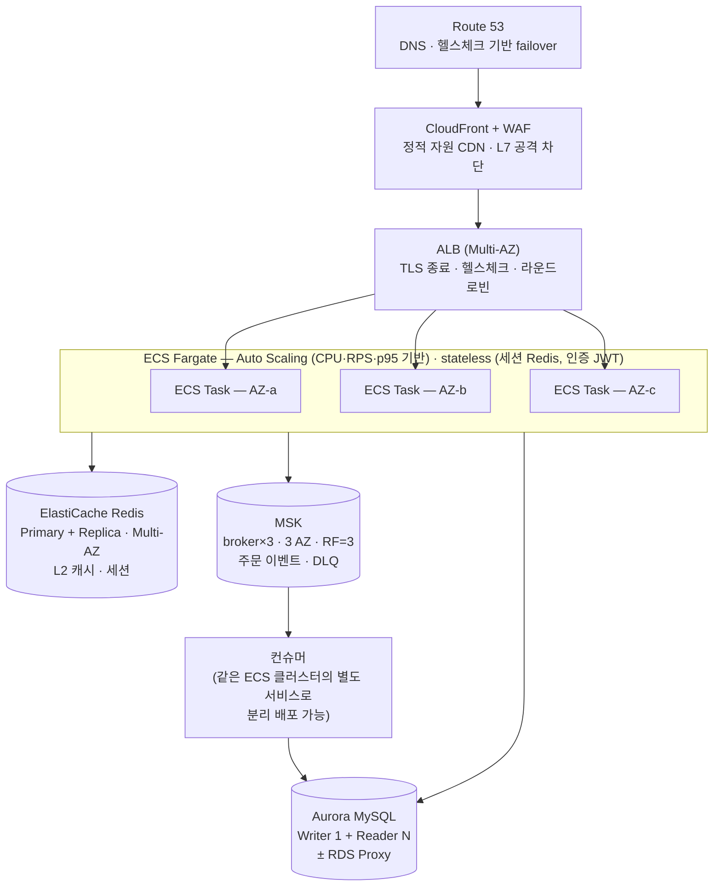

# 스케일러블 아키텍처 (AWS 기준 확장 설계)

> 이 데모는 **단일 인스턴스에서 SW적으로 1000 TPS를 측정**하는 프로젝트다.
> 이 문서는 "실서비스라면 인프라(HA·확장)는 어떻게 가져가나"라는 면접 질문에 답하기 위한 설계.
> 원칙: **로컬 데모의 각 구성요소 → AWS 관리형 서비스로 1:1 매핑**이 되도록 앱을 처음부터 stateless하게 설계했다.

---

## 1. 로컬 데모 → AWS 매핑

| 로컬 (Docker Compose) | AWS (운영) | HA 포인트 |
|---|---|---|
| Spring Boot 단일 프로세스 | **ECS Fargate** (또는 EC2 ASG) + **ALB** | 멀티 AZ에 태스크 분산, ALB 헬스체크로 비정상 태스크 자동 교체 |
| MySQL 8.0 (단일 컨테이너) | **Aurora MySQL** (또는 RDS Multi-AZ) | Writer 장애 시 Reader 자동 승격(failover ~30초), 리드 레플리카로 읽기 분산 |
| Redis 7 (단일, AOF) | **ElastiCache for Redis** (Cluster mode + Multi-AZ) | 프라이머리 장애 시 레플리카 자동 승격, 샤딩으로 용량 확장 |
| Kafka (KRaft 단일 노드) | **MSK** (브로커 3개, 3 AZ) | replication-factor=3, min.insync.replicas=2 → 브로커 1대 장애에도 무손실 |
| Prometheus + Grafana | CloudWatch (또는 AMP + AMG) | 관리형이라 모니터링 자체의 가용성 확보 |

## 2. 전체 그림

## 3. 1000+ TPS를 받아내는 확장 전략

### 3-1. 앱 계층 — 수평 확장이 성립하는 조건
- **Stateless 강제**: 세션을 Redis에 두고(또는 JWT), 로컬 상태를 만들지 않는다.
  → 이 데모에서 `SessionCreationPolicy.STATELESS` + Redis 세션을 쓰는 이유가 이것.
- **용량 산정은 측정으로**: 단일 인스턴스 실측 TPS(→ [benchmarks.md](./benchmarks.md))를 기준으로
  `필요 태스크 수 = ceil(목표 TPS / 인스턴스당 실측 TPS × 여유율 1.5~2)`.
  예: 인스턴스당 800 TPS 실측이면 1000 TPS 목표에 2태스크 + 피크 대비 오토스케일.
- **스케일아웃 트리거**: CPU 70% / 태스크당 RPS / p95 응답시간. 스케일인은 보수적으로(플래핑 방지).

### 3-2. DB 계층 — 가장 먼저 병목이 되는 곳
- **쓰기(주문)**: 단일 Writer가 한계 →
  (1) Kafka 비동기화로 쓰기 피크를 평탄화(이 데모의 축 1이 정확히 이 패턴),
  (2) 그래도 부족하면 샤딩(주문ID 해시) — 복잡도가 크게 올라가므로 최후 수단.
- **읽기(상품)**: 캐시 계층화(L1 Caffeine → L2 Redis)로 DB 도달 트래픽 자체를 줄임(축 2).
  캐시 미스 잔여분은 Aurora 리더로 분산.
- **커넥션 폭발 주의**: 태스크 N개 × 풀 20 = 커넥션 N×20. 스케일아웃할수록 DB 커넥션이 먼저 고갈
  → **RDS Proxy**로 커넥션 멀티플렉싱, 앱 풀 크기는 측정 기반으로 최소화.

### 3-3. Kafka 계층 — 파티션 = 병렬성의 상한
- 파티션 수 ≥ 최대 컨슈머 인스턴스 수로 미리 설계(파티션 축소는 불가, 증설은 키 재배치 유발).
- 주문ID를 파티션 키로 → 같은 주문은 같은 파티션 → **순서 보장 + 멱등 처리**가 단순해짐.
- 컨슈머 랙(lag)을 오토스케일 지표로: 랙 증가 = 컨슈머 증설 신호.

### 3-4. 캐시 계층
- L1(Caffeine)은 인스턴스 로컬 → 스케일아웃하면 인스턴스 수만큼 L1 불일치 창이 생김
  → 변경 이벤트를 Redis pub/sub(또는 Kafka)로 브로드캐스트해 각 인스턴스 L1 무효화(축 2에서 구현·측정).
- Cache Stampede: 인기 키 만료 순간 수백 요청이 DB로 몰림 → 단일 비행(single-flight) 잠금 또는 TTL 지터.

## 4. HA (고가용성) 체크리스트

| 계층 | 장애 시나리오 | 대응 |
|---|---|---|
| 앱 | 태스크/AZ 다운 | 멀티 AZ 분산 + ALB 헬스체크 → 자동 교체. graceful shutdown(처리 중 요청 드레인) |
| DB | Writer 다운 | Aurora 자동 failover(~30초). 앱은 재시도 + 타임아웃으로 흡수 |
| Redis | Primary 다운 | 레플리카 승격. **캐시는 죽어도 서비스는 살아야 함** → 캐시 미스 = DB 폴백으로 설계(축 2) |
| Kafka | 브로커 1대 다운 | RF=3, acks=all, min.insync.replicas=2 → 무손실. Producer 재시도 + 멱등 프로듀서 |
| 컨슈머 | 처리 실패 | 재시도(백오프) → DLQ 격리 → 운영자 재처리(축 1에서 구현) |
| 리전 | 리전 장애 | 데모 범위 밖. 필요 시 Route 53 failover + 크로스리전 레플리카 (RTO/RPO 요구사항에 따라) |

핵심 원칙: **"어디가 죽어도 주문은 유실되지 않는다"** — 동기 구간(접수~Kafka 발행)은 짧게,
나머지는 재시도 가능한 비동기로. 이것이 축 1(동기 vs 비동기)을 측정하는 운영상의 이유.

## 5. 이 데모와의 연결 (면접 답변 구조)

1. "단일 인스턴스에서 k6로 실측한 TPS가 있다" → benchmarks.md 수치 제시.
2. "앱을 stateless로 설계했으므로 그 수치 × N으로 수평 확장이 성립한다" → 본 문서 3-1.
3. "그때 진짜 병목은 앱이 아니라 DB·커넥션·파티션이며, 각각 이렇게 푼다" → 3-2 ~ 3-4.
4. "HA는 계층별 장애 시나리오로 답한다" → 4절.

## 6. 의도적으로 데모에서 제외한 것 (트레이드오프)
- 멀티 리전, 크로스리전 DR — 요구사항(RTO/RPO) 없이 설계하면 과잉.
- 서비스 메시, MSA 분리 배포 — decisions.md 2절(모듈러 모놀리식) 참고.
- IaC(Terraform/CDK) — 본 문서는 설계 답변용이며, 실제 프로비저닝은 범위 밖.
